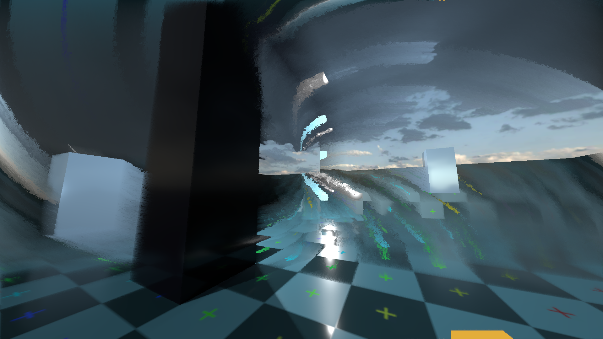

# godot-compositor-datamosh

A real-time datamosh effect for Godot 4.4+, implemented as a `CompositorEffect` using motion vectors and temporal accumulation.

<video src="medias/vid0.mp4" autoplay loop muted width="100%"></video>

---

## What it does

Datamoshing is a visual effect where motion data from previous frames bleeds into the current frame, causing the image to smear, streak, and accumulate in ways that feel like a corrupted video transmission. This implementation drives that process using Godot's built-in motion vectors, so the effect responds directly and in real time to movement in the scene — camera movement, moving objects, everything.

The result is somewhere between a glitch artifact, a ghosting effect, and something that feels almost organic. See it in a fully developed context in [Signals Adrift](https://goosegardenstd.itch.io/signals-adrift).

This version of the compositor effect has a slightly simplified set of parameters, for clarity.

---

## Requirements

- Godot 4.4 or later
- A GPU that supports the FRoward+ renderer.

---

## What's in the repo

- The `CompositorEffect` shader and GDScript wrapper — you can drop the « dmosh » folder into your own project .
- A minimal demo scene with basic 3D geometry and rigid body physics to stress-test the effect with chaotic movement
- An in-game GUI exposing the shader's parameters directly. Press ‘Tab’ to toggle it.
- A preset system — load and save parameter sets as Resource files, a few presets are included to give a starting point.

---

## How to use it in your own project

1. Copy the `datamosh` folder into your Godot project
2. In your `WorldEnvironment`, add a new `CompositorEffect` and select `DatamoshEffect`
4. Run the scene — the effect is active immediately

---

## Key parameters

The Effects Parameters can be accessed, through code , as the « mp » export dictionnary of the compositor effect script.

In the demo scene, the full parameter set is exposed in the GUI, that can be toggled by pressing ’Tab’. 

It has 4 sections :

The 1st holds the parameters controlling the color accumulation from the incoming rendered scene image. Changing these parameters will have the most immediatly visible results

The 2nd deals with velocity accumulation.

Both color and velocity accumulation have a similar set of parameters, allowing  the use of depth and luminance, as accumulation blending factors. 
There could be many more possibilities.

The third section deals  a few with extra effects :

A simple sobel edge effect.

« Wind « and « ripples » add arbitrary vector forces that are added to the scene’s resolved velocity.
Again there could be many more possibilities.

The 4th section gives the possibility of a very basic time animation of one of the parameters, just to give an idea of the whole extra dimension these effect can get when animated in time.

---

## Presets

The parameters interact with each other in non-linear ways, and the interesting results are often in narrow ranges that are hard to find by reasoning alone
The included presets are good starting points — you can use them as anchors and nudge from there rather than starting from scratch.

---

## Limitations and gotchas

- The effect requires motion vectors, which have a small performance cost. On low-end hardware this may be noticeable.
- Very fast camera movement can cause the accumulation to diverge faster than the decay can compensate — the image becomes noise temporarily. This is expected behavior, not a bug. Reduce accumulation strength if this is a problem.
- The effect is applied full-screen. Per-object or masked application using SDFs is possible but not included in this demo.

---

## License

MIT — see LICENSE file. Use it freely, credit appreciated but not required.

---

## Author

[GooseGardenStd](https://goosegardenstd.itch.io)
